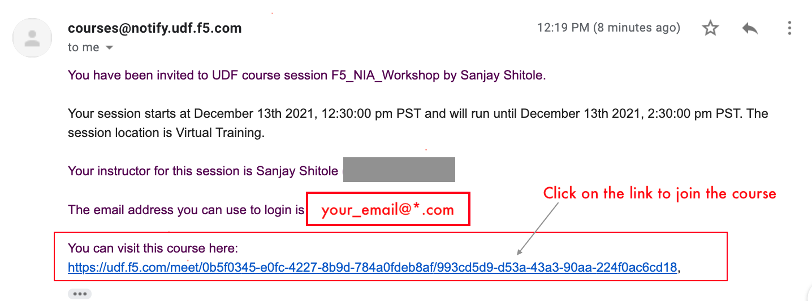
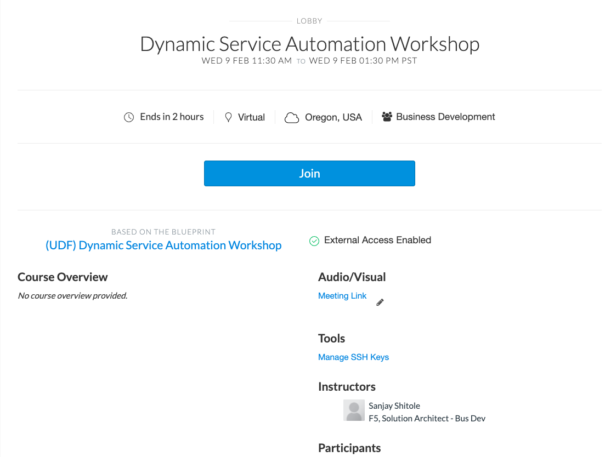
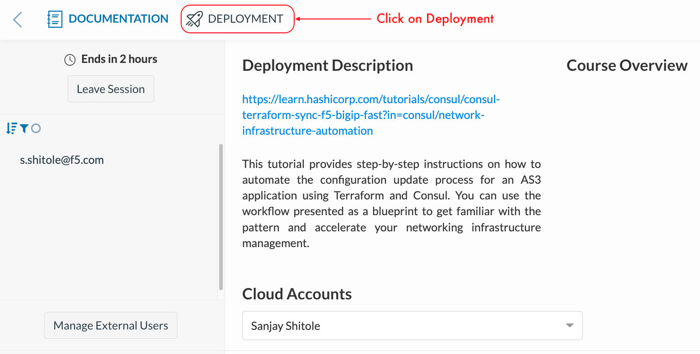
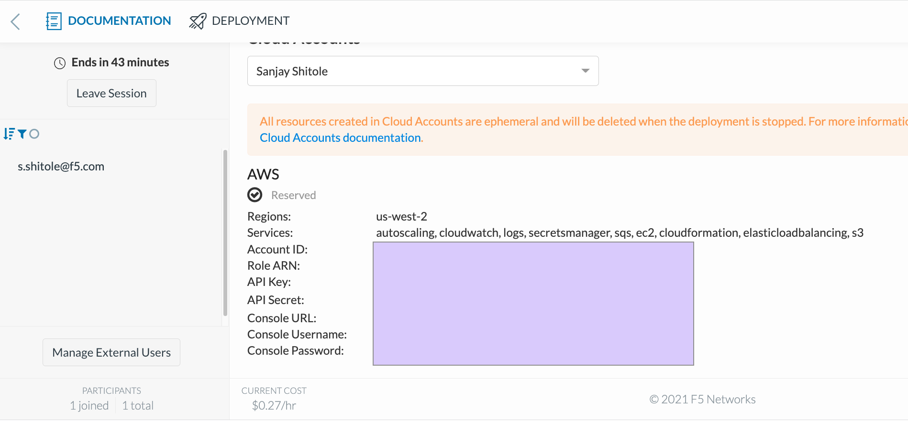
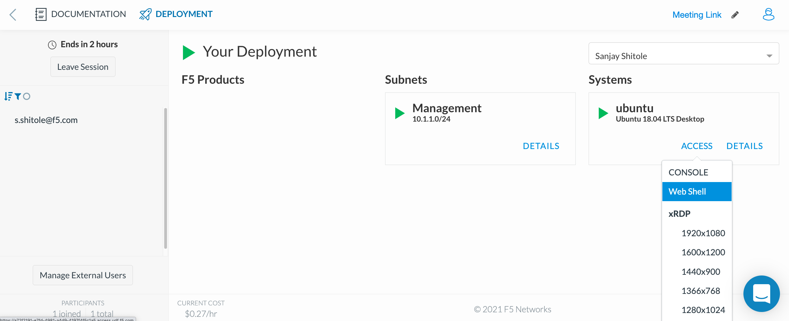
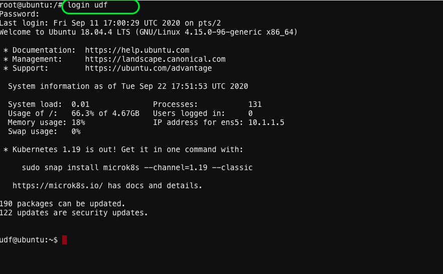

# Accessing the Lab using UDF. Setup AWS Access key and secret.

1. Prior to this workshop, student must have received an email with your login instructions and a link to access the UDF course.

   
   
   **Note:** If you are not able to find these details please ask instructor.
   
2. On clicking the link, you will enter the course lobby as shown below. Verify the course name (Dynamic Service Networking) and click Join.

   
   
3. Click on DEPLOYMENT buttom on the top left to begin provisioning your personal lab access server and network in AWS.

   

4. Ensure the 'Region' is ``` us-west-2 ```
   
5. On the browser, under the deployment tab, click on **Cloud Accounts** and look for the **API Key** and **API Secret** as shown below

   

6. Copy the **API Key** & **API Secret key** into your clipboard

7. Access your Ubunutu webshell by clicking on Components TAB & then click on Ubuntu --> Access --> WEB SHELL. 

   
    
8. Once you are on the CLI, at the prompt type: ``` login udf ``` & when prompted for Password, type ``` udf ```

   

9. Configure your API key and API secret key using the below commands. 
   **Note:** you will need to use your API key and API secret key you copied earlier in step 5 & 6
```
 aws configure

    AWS Access Key ID [****************CGGT]:XXXXXXXXXXXXX

    AWS Secret Access Key [****************QmTY]:XXXXXXXXXXX
```

  **Note:** You can also export the keys if you wish. 

You now have access to your AWS environment. We are now ready to deploy and configure our infrastructure. Go to [Exercise 1.2 - Subscribe to BIG-IP from AWS marketplace](../Exercise 1.2 - Subscribe to BIG-IP from AWS marketplace/README.md) to subscribe to F5 BIG-IP from AWS marketplace. 


[GoBack](../index.md)
