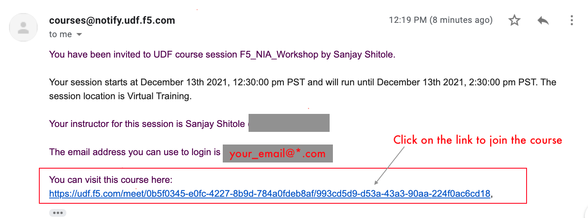
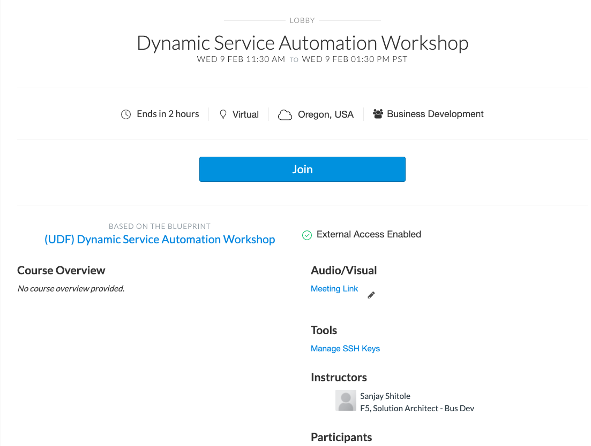
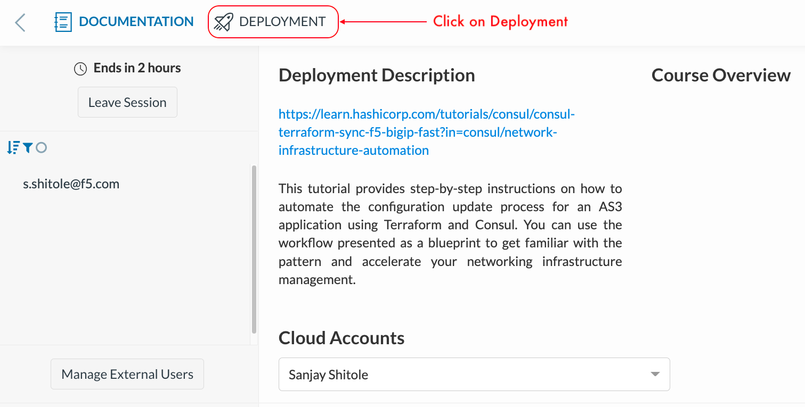
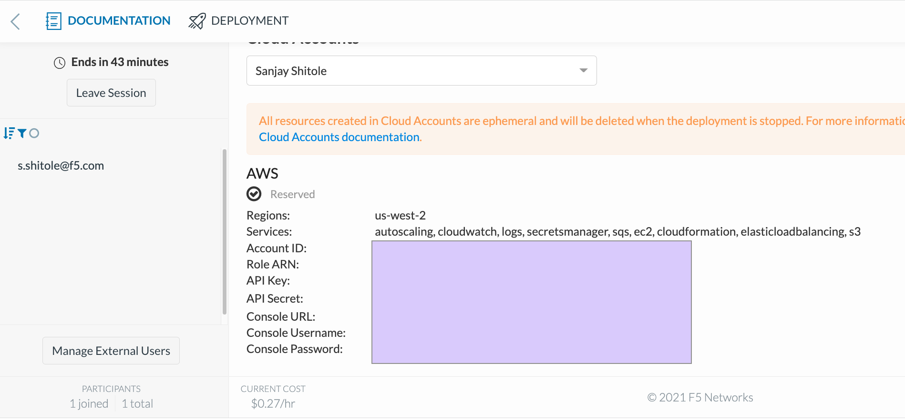
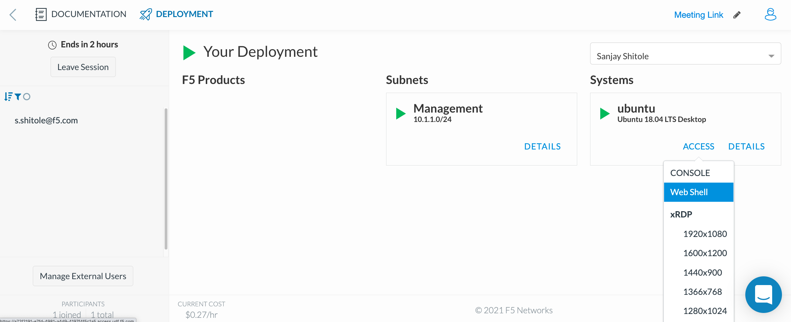
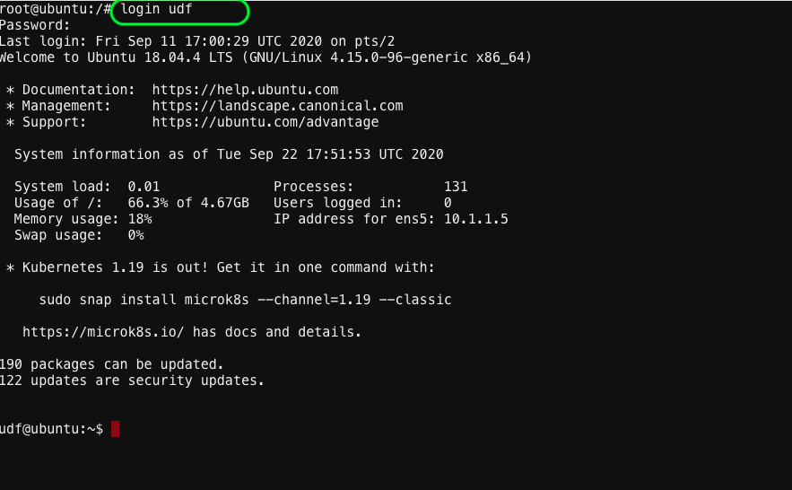

# Exercise 1.1 - Explore UDF and access AWS environment.

1. Prior to this workshop, student must have received an email with your login instructions and a link to access the UDF course.
   We need this to access and deploy  infrastructure on AWS for this lab. 

   
   
   **Note:** If you are not able to find these details please ask instructor.
   
2. On clicking the link, you will enter the course lobby as shown below. Verify the course name (Dynamic Service Networking) and click Join.

   
   
3. Click on DEPLOYMENT buttom on the top left to begin provisioning your personal lab access server and network in AWS.
   Here we are creating a ubuntu server to access to AWS resources

   

4. Ensure the 'Region' is ``` us-west-2 ```
   Currently the lab is only design for AWS resources in us-west-2

   
5. On the browser, under the deployment tab, click on **Cloud Accounts** and look for the **API Key** and **API Secret** as shown below
   We will be using these AWS Secret Keys to authenticate the AWS Cloud to create infrastructure.

   

6. Copy the **API Key** & **API Secret key** into your clipboard

7. Access your Ubunutu webshell by clicking on Components TAB & then click on Ubuntu --> Access --> WEB SHELL. 

   
    
8. Once you are on the CLI, at the prompt type: ``` login udf ``` & when prompted for Password, type ``` udf ```
   Our username for the ubuntu server  is ```udf``` we will use this account to create resources on AWS

   

9. Configure your API key and API secret key using the below commands. 
   **Note:** you will need to use your API key and API secret key you copied earlier in step 5 & 6
```
 aws configure

    AWS Access Key ID [****************CGGT]:XXXXXXXXXXXXX

    AWS Secret Access Key [****************QmTY]:XXXXXXXXXXX
```

  **Note:**  Let region be default us-west-2

You now have access to your AWS environment. We are now ready to deploy and configure our infrastructure. Go to [Exercise1.2](../Exercise1.2) to subscribe to a trial versiono of F5 BIG-IP from AWS marketplace. 


[GoTo Next Exercise1.2](../Exercise1.2/README.md)

[GoBack](../README.md)
