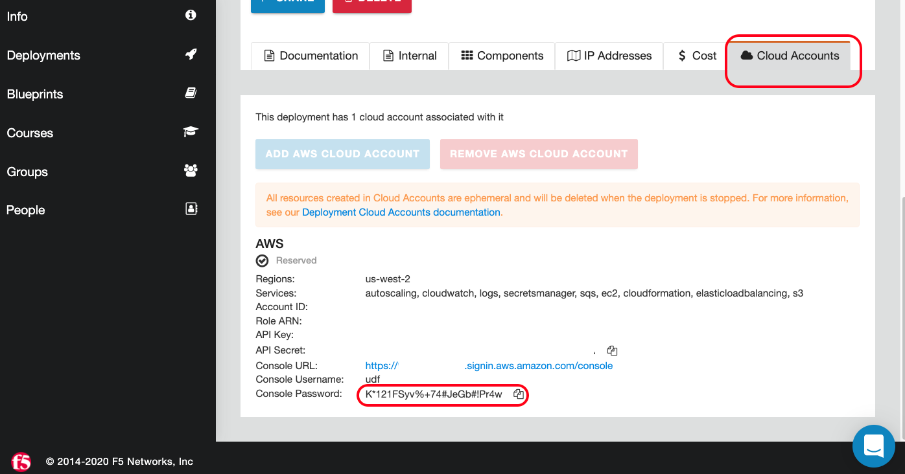
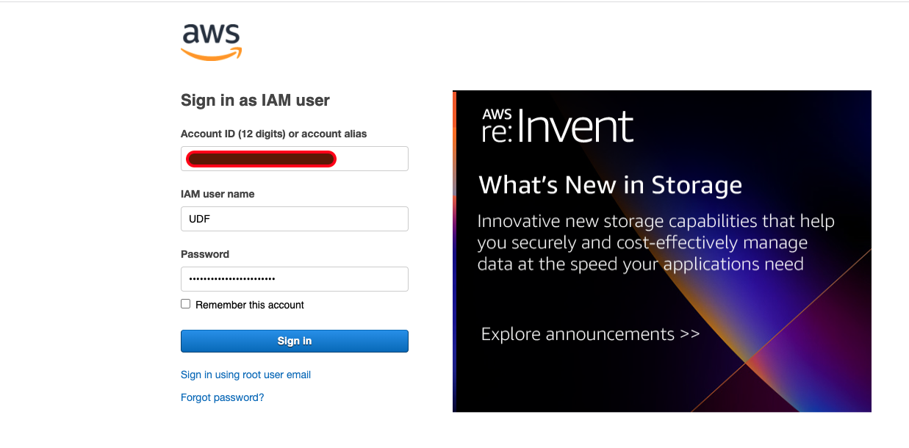

- Login to AWS Console by going to UDF Blueprint –> Cloud Accounts –> Console URL
  (We are logging into AWS Console to subscribe BIG-IP VE)

   
   
  
   (Use this link to subscribe to VE on AWS)

- [Click on the link](https://aws.amazon.com/marketplace/pp?sku=8esk90vx7v713sa0muq2skw3j) to subscribe for the BIG-IP VE
- Or copy and paste the link https://aws.amazon.com/marketplace/pp?sku=8esk90vx7v713sa0muq2skw3j in the browser

Search for **F5 BIG-IP Virtual Edition - GOOD (PAYG, 25Mbps)**, Subscribe to the trial service and click 'Accept'.

**Note:**  Once you hit Accept it will take atleast one minute to change the pending status

   

- Wait for the effective date to change from **pending** to an actual date
   

[GoTo Next Exercise1.3](../Exercise1.3)

[GoBack](../README.md)
