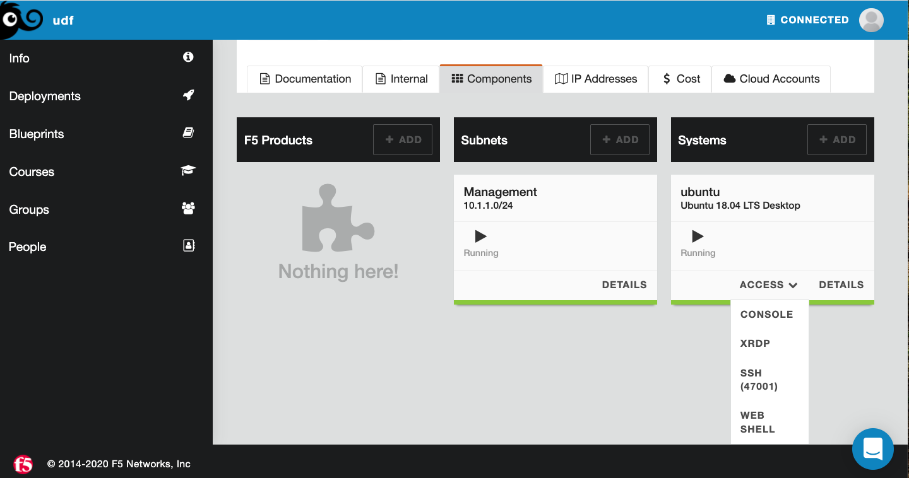
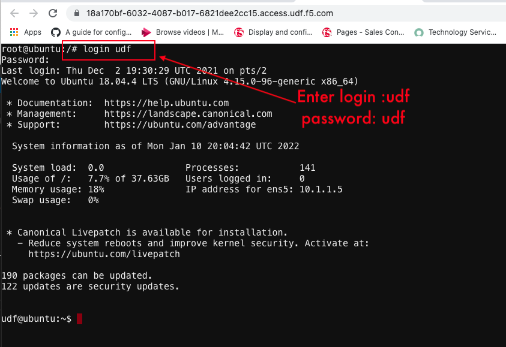

1. Open the Web Shell if not open  and login to udf/udf

Here we will be accessing the jump box or ubuntu server to run the terraform scripts,
 we need to first click on the webshell and then login to the server as ```udf``` and password as ```udf```
   

   

[GoBack](../README.md)
