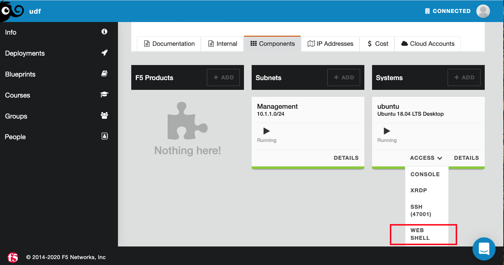

1. Open the Web Shell if not open  and login to udf/udf
Here we will be accessing the jump box or ubuntu server to run the terraform scripts, we need to first click on the webshell and then login to the server as ```udf``` and password as ```udf```
   

   

2. Change the directory ```cd f5-terraform-consul-sd-webinar/terraform```

3. Run ```terraform apply -auto-approve```

4. You should see IP addresses, SSH and passsword details for your infrastructure.
   

